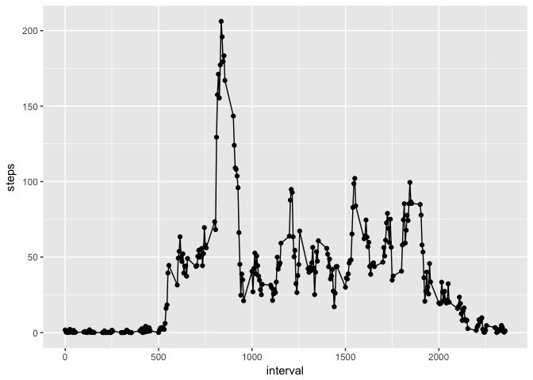
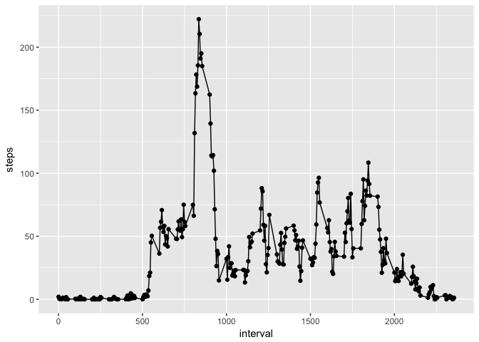
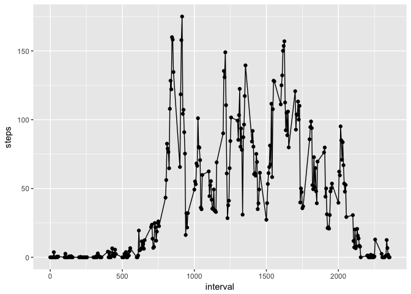

# Reproducible Research: Peer Assessment 1

## Loading and preprocessing the data

```r
# unzip the zip file
unzip("activity.zip", files = "activity.csv")

# read the csv file and assign it to "activity" variable
activityWithNA <- read.csv(file = "activity.csv", header = TRUE, sep = ",")

# remove NA data
activity<-na.omit(activityWithNA)
```

## What is mean total number of steps taken per day?

```r
# calculate the  total number of steps per day
stepsPerDay <- aggregate(steps ~ date, activity, sum)

# Calculate the sum of steps, them divide the sum by the number of qunique days
sum(activity$steps)/length(unique(activity$date))
```

```
## [1] 10766.19
```

```r
# Calculate the mean of steps
median(stepsPerDay$steps)
```

```
## [1] 10765
```

## What is the average daily activity pattern?

```r
library(ggplot2)

# aggregrate the steps of each interval
stepsInterval <- aggregate(steps ~ interval, activity, mean)

# plot the scatter plot of daily date and steps
ggplot(stepsInterval, aes(x=interval, y=steps, group=1)) +
  geom_line()+
  geom_point()
```

<!-- -->

## Imputing missing values

```r
# the total number of missing values
nrow(activityWithNA[is.na(activityWithNA$steps),])
```

```
## [1] 2304
```

```r
# replace NAs with 0
activityWithoutNA <- activityWithNA
activityWithoutNA[is.na(activityWithoutNA$steps), "steps"] <- 0

# aggregate the data
stepsPerDayNoNAs <- aggregate(steps ~ date, activityWithoutNA, sum)

# calculate the mean
mean(stepsPerDayNoNAs$steps)
```

```
## [1] 9354.23
```

```r
# calculate the median
median(stepsPerDayNoNAs$steps)
```

```
## [1] 10395
```

## Are there differences in activity patterns between weekdays and weekends?

```r
library(dplyr)
```

```
## 
## Attaching package: 'dplyr'
```

```
## The following objects are masked from 'package:stats':
## 
##     filter, lag
```

```
## The following objects are masked from 'package:base':
## 
##     intersect, setdiff, setequal, union
```

```r
# create new colomn which identifies the weekdays and weekends
activity$day <- weekdays(as.Date(activity$date))
```

```
## Warning in strptime(xx, f <- "%Y-%m-%d", tz = "GMT"): unknown timezone
## 'zone/tz/2018c.1.0/zoneinfo/America/New_York'
```

```r
# subset the data by weekdays and weekends
activityWeekday <- subset(activity, !(day == "Sunday"), !(day=="Saturday"))
activityWeekend <- subset(activity, (day == "Sunday" | day=="Saturday"))

# aggregate the weekday data and plot it
stepsIntervalWeekday <- aggregate(steps ~ interval, activityWeekday, mean)

ggplot(stepsIntervalWeekday, aes(x=interval, y=steps)) +
  geom_line()+
  geom_point()
```

<!-- -->

```r
stepsIntervalWeekend <- aggregate(steps ~ interval, activityWeekend, mean)

# aggregate the weekend data and plot it
ggplot(stepsIntervalWeekend, aes(x=interval, y=steps)) +
  geom_line()+
  geom_point()
```

<!-- -->
